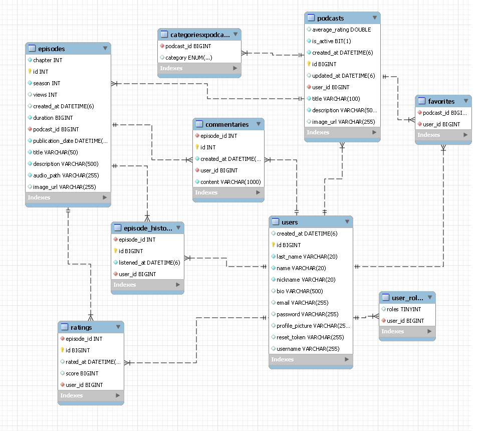
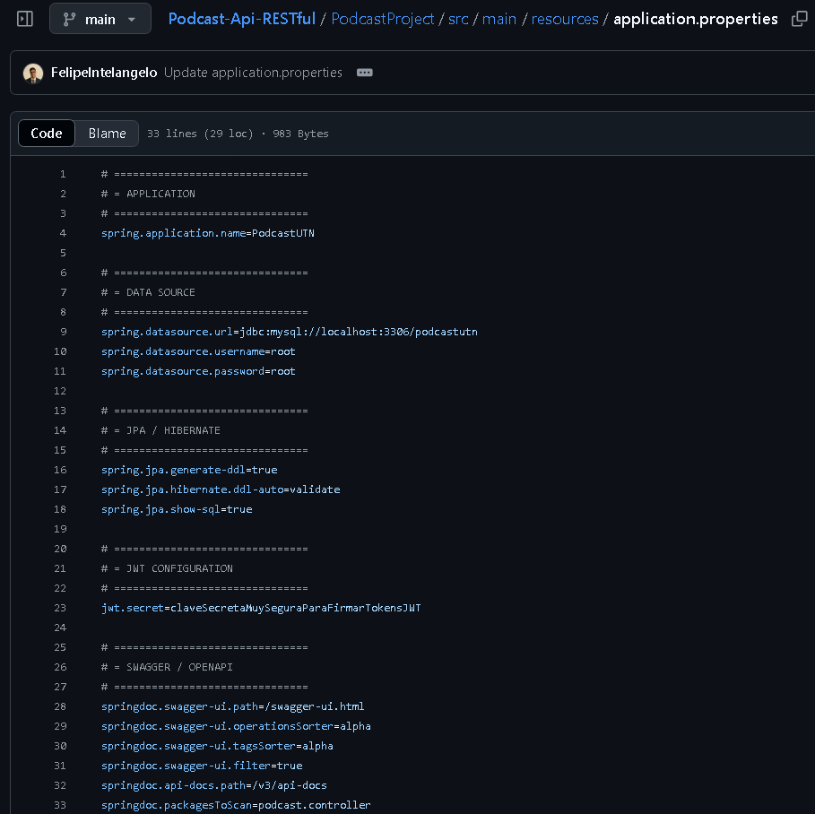

# 🎧 Podcast API

Una API RESTful para gestionar una plataforma de podcasts. Permite a los usuarios registrarse, escuchar episodios, calificarlos, marcarlos como favoritos, dejar comentarios y más. Este backend está pensado para ser consumido por un cliente (como una app móvil o frontend web), pero actualmente **no incluye interfaz visual**.

---

## 🚀 Tecnologías

- **Lenguaje:** Java
- **Framework** SpringBoot
- **Base de datos:** MySQL
- **ORM recomendado:** Hibernate

---

## 📂 Estructura del modelo

**Diagrama Entidad - Relación**



### 👤 `users`
Contiene la información básica del usuario.

- `name`, `last_name`, `nickname`, `email`, `username`
- `bio`, `profile_picture`
- `password` (encriptado)
- `reset_token` 

### 🗂 `podcasts`
Representa cada podcast creado por un usuario.

- `title`, `description`, `image_url`
- `is_active`: indica si está publicado
- Relación con `users` (user_id)

### 📚 `categoriesxpodcasts`
Tabla intermedia para categorizar podcasts.

- `podcast_id`, `category` (ENUM)

### 🎙 `episodes`
Episodios dentro de un podcast.

- `title`, `description`, `duration`, `audio_path`, `image_url`
- `publication_date`, `average_rating`, `views`
- Relación con `podcasts`

### 🧾 `episode_history`
Historial de reproducción del usuario.

- `episode_id`, `user_id`
- `listened_at`, `rated_at`, `rating`

### 💬 `commentaries`
Comentarios de usuarios en episodios.

- `user_id`, `episode_id`, `content`

### ❤️ `favorites`
Relación entre usuarios y podcasts que les gustan.

- `user_id`, `podcast_id`

### 🔐 `user_roles`
Tabla para gestión de roles (admin, editor, user, etc.).

---

## 📡 Endpoints (ejemplos)

> ⚠️ Todos los endpoints están en formato RESTful y devuelven JSON.

### Autenticación
- `POST /auth/register` → Crea usuario
- `POST /auth/login` → Login y JWT

### Usuarios
- `GET /users/:id` → Info pública
- `PUT /users/:id` → Editar perfil
- `GET /users/:id/favorites` → Ver favoritos

### Podcasts
- `GET /podcasts` → Listado general
- `POST /podcasts` → Crear nuevo
- `GET /podcasts/:id` → Detalle
- `PUT /podcasts/:id` → Editar
- `DELETE /podcasts/:id` → Eliminar

### Episodios
- `GET /episodes/:id` → Info de episodio
- `POST /episodes` → Crear
- `GET /podcasts/:id/episodes` → Todos los episodios del podcast

### Comentarios
- `POST /episodes/:id/comments` → Agregar comentario
- `GET /episodes/:id/comments` → Ver comentarios

### Historial y rating
- `POST /episodes/:id/history` → Marcar como escuchado
- `PUT /episodes/:id/rate` → Puntuar episodio

---

## 🛠 Instalación

```bash
git clone https://github.com/FelipeIntelangelo/podcast.git
cd podcast-api
npm install
npm run dev

* Autenticación
* Flujo sugerido completo
* Códigos de ejemplo
* Link a colección Postman
  ✅ **Todo listo para copiar/pegar al final del README**.
````

* IMPORTANTE: VERIFICAR UNA VEZ EJECUTADO EL PROYECTO POR PRIMERA VEZ
              MODIFICAR jpa.hibernate.ddl-auto = create
*             spring.jpa.hibernate.ddl-auto = validate
  EN
*          PodcastProject/src/main/resources/application.properties


   De esta manera deberia quedar y nos aseguramos que no cree la base de datos cada vez
   que se levante el servidor, perdiendo todos nuestros datos almacenados.

---
```bash
## 🧪 Testing de la API

Se recomienda usar herramientas como **Postman** para probar los endpoints.  
A continuación, algunas pautas para testear correctamente.

---

### 🔐 Autenticación

- **Login**  
  `POST /login`  
  _Body de ejemplo:_
  ```json
  {
    "username": "usuario123",
    "password": "contrasena123"
  }
````

* Una vez autenticado, incluí el token JWT en el header de cada request protegida:

  ```
  Authorization: Bearer <tu_token_aquí>
  ```

---

### ✅ Flujo sugerido para testeo manual

Este es un flujo base para validar que toda la API funciona correctamente de extremo a extremo:

1. **Registrar un usuario**
   `POST /register`
   *Body:*

   ```json
   {
     "name": "Juan",
     "last_name": "Pérez",
     "nickname": "jperez",
     "email": "juan@mail.com",
     "username": "juan123",
     "password": "claveSegura"
   }
   ```

2. **Iniciar sesión y obtener token JWT**
   `POST /login`
   *Body:*

   ```json
   {
     "username": "juan123",
     "password": "claveSegura"
   }
   ```

3. **Crear un podcast**
   `POST /podcasts/save`
   *Headers:*
   `Authorization: Bearer <token>`
   *Body:*

   ```json
   {
     "title": "Mi Primer Podcast",
     "description": "Podcast sobre tecnología y desarrollo",
     "image_url": "https://image.com/logo.jpg"
   }
   ```

4. **Crear un episodio**
   `POST /episodes`
   *Headers:*
   `Authorization: Bearer <token>`
   *Body:*

   ```json
   {
     "podcast_id": 1,
     "title": "Introducción al proyecto",
     "description": "Explicamos de qué se va a tratar el podcast.",
     "audio_path": "https://audio.com/intro.mp3",
     "image_url": "https://image.com/cap1.jpg",
     "duration": 360,
     "season": 1,
     "chapter": 1,
     "public_action_date": "2025-06-01T00:00:00"
   }
   ```

5. **Reproducir episodio (marcar como escuchado)**
   `GET /episodes/playEpisode?id=1`
   *Headers:*
   `Authorization: Bearer <token>`

6. **Comentar episodio**
   `POST /commentary`
   *Headers:*
   `Authorization: Bearer <token>`
   *Body:*

   ```json
   {
     "episode_id": 1,
     "content": "Muy buen episodio, sigan así!"
   }
   ```

7. **Calificar episodio**
   `POST /rate`
   *Headers:*
   `Authorization: Bearer <token>`
   *Body:*

   ```json
   {
     "episode_id": 1,
     "score": 5
   }
   ```

8. **Agregar podcast a favoritos**
   `POST /users/toMyFavs`
   *Headers:*
   `Authorization: Bearer <token>`
   *Body:*

   ```json
   {
     "podcast_id": 1
   }
   ```

9. **Ver historial de reproducción**
   `GET /users/history`
   *Headers:*
   `Authorization: Bearer <token>`

10. **Ver favoritos**
    `GET /users/favs`
    *Headers:*
    `Authorization: Bearer <token>`

---

---

## 📁 Colecciones Postman

Para facilitar el testing de la API, podés importar las siguientes colecciones de Postman, organizadas por módulo.  
Cada una contiene todos los endpoints relevantes y ejemplos de uso:

- 🎧 **Episodios**  
  [🔗 Ver colección de Episodios](https://intelangelofelipe.postman.co/workspace/Intelangelo-Felipe's-Workspace~be26952f-9c9f-40b0-89c2-6c98002e26fb/collection/45430153-7c3e5f6e-cd55-4802-9653-99bd628340cd?action=share&creator=45430153)

- 📻 **Podcasts**  
  [🔗 Ver colección de Podcasts](https://intelangelofelipe.postman.co/workspace/Intelangelo-Felipe's-Workspace~be26952f-9c9f-40b0-89c2-6c98002e26fb/collection/45430153-46933ec1-9ee0-43be-9b19-e5c42a4d8e7c?action=share&creator=45430153)

- 👤 **Usuarios**  
  [🔗 Ver colección de Usuarios](https://intelangelofelipe.postman.co/workspace/Intelangelo-Felipe's-Workspace~be26952f-9c9f-40b0-89c2-6c98002e26fb/collection/45430153-8f9113fd-7b5f-4a90-b51f-0a3a0c702ea7?action=share&creator=45430153)

> 💡 Tip: Podés importar los links directamente en Postman desde `File > Import > Link` y pegar cualquiera de los URLs anteriores.


